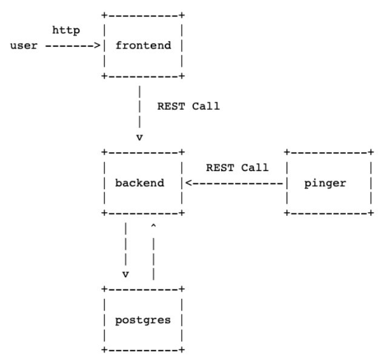

## Задача

Необходимо написать приложение на языках программирования Go и JavaScirpt, которое получает ip адреса контейнеров Docker, пингует их с определенным интервалом и помещает данные в базу
данных.
Получение данных о состоянии контейнеров доступно на динамически формируемой веб-странице.

## Сервисы

В результате выполнения задания должны появиться 4
сервиса:

1. Backend-сервис обеспечивает RESTful API для запроса данных из DB и добавления туда новых данных.
2. Frontend-сервис должен быть написан на JS с использованием любой библиотеки пользовательских интерфейсов (предпочтительно React). Берет данные через API Backend и отображает данные по всем IP адресам в виде таблицы: IP адрес, время пинга, дата последней успешной попытки. Для отображения данных в html можно использовать bootstrap или antd или подобное.
3. База данных PostgreSQL.
4. Сервис Pinger. Получает список всех docker-контейнеров, пингует их и отправляет данные в базу через API frontend.
5. Дополнительная сложность: добавление nginx, сервис очередей, использовать пел, отдельный конфиг для сервиса с верификацией.



## Запуск

Для запуска программы необходимо ввести следующую последовательность комманд:
```
git clone https://github.com/SukharevaSofia/conmon
cd conmon
docker compose up
```

## Функционал

- Nginx находится по адресу `http://127.0.0.1:8080/`
- Pinger сервис пингует контейнеры с настраиваемым интервалом

### Стек

- Nginx
- Frontend на bootstrap 5
- Backend и Pinger сервисы на Golang
- PostgreSQL хранит данные

## Настройки

- Изменить интервал, с которым пингуются контейнеры можно поменяв переменную `PING_INTERVAL_MS` в `docker-compose.yaml`
